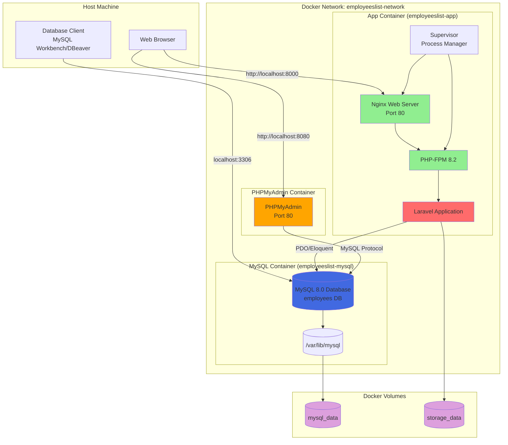
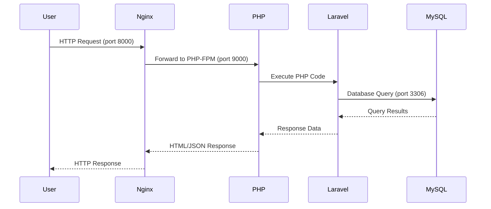
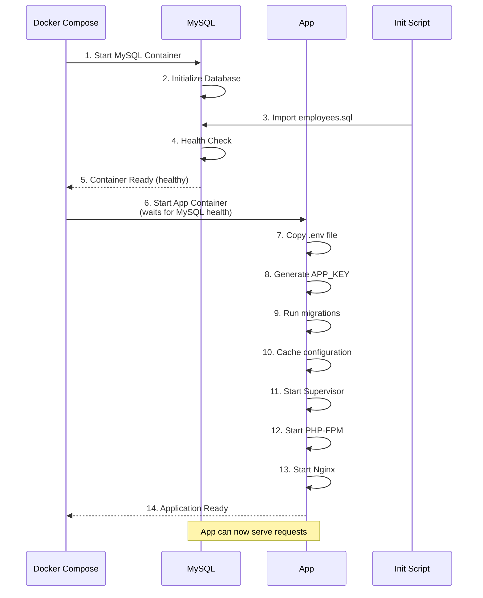
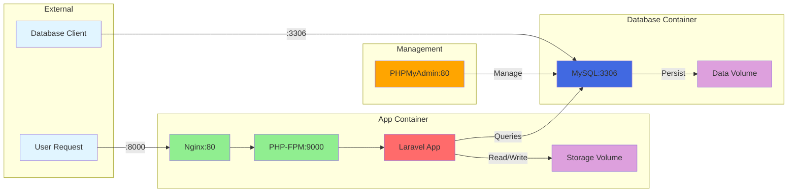
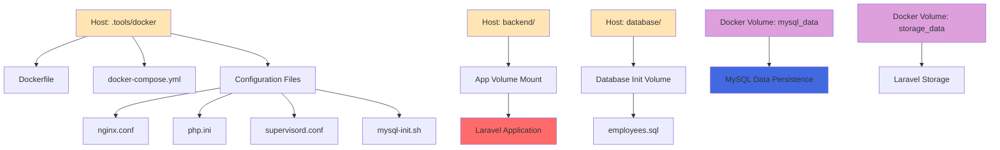
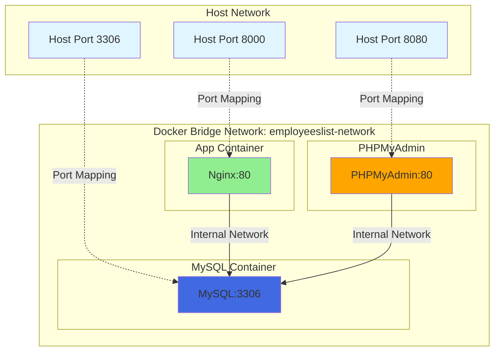
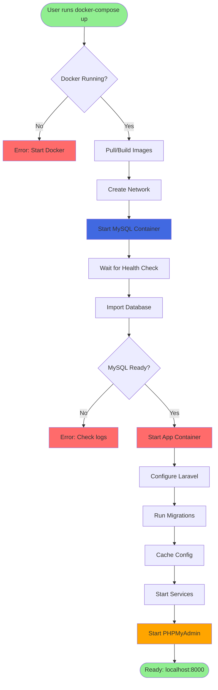
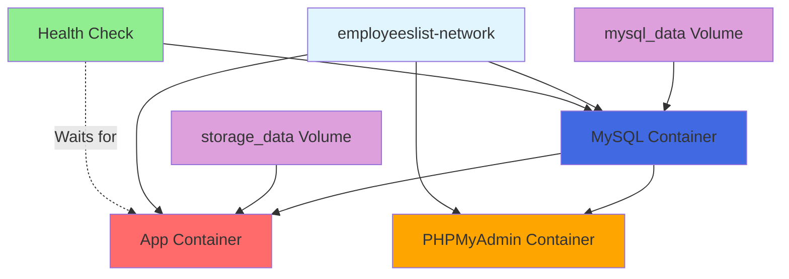
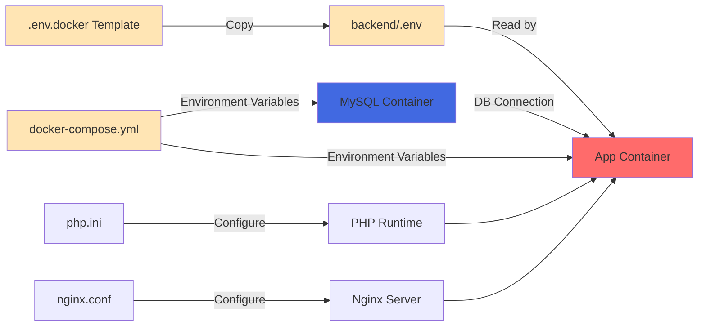
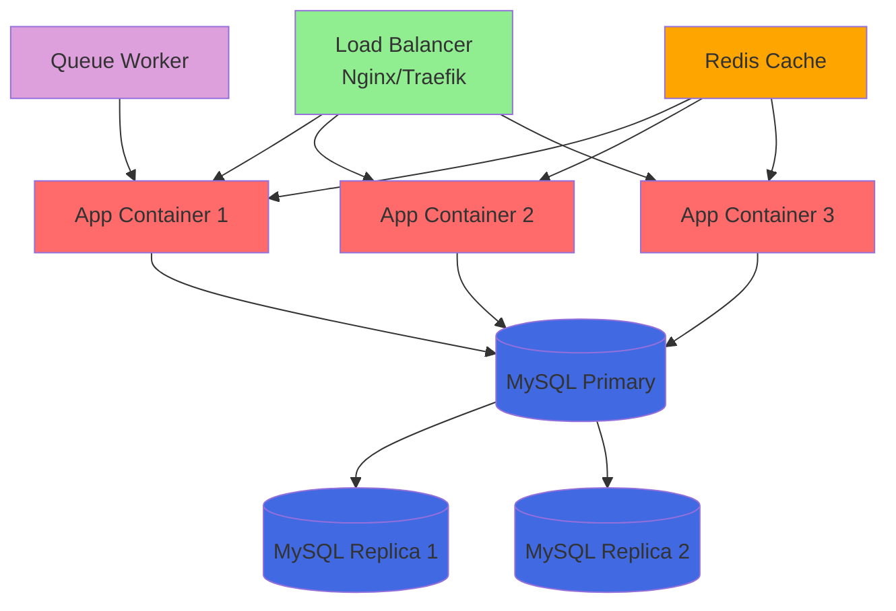

# Docker Architecture

**Docker Project Name**: `employeeslist-project`

This document describes the architecture and component relationships of the Dockerized Employees List application.

## System Architecture Diagram

## Container Communication Flow

## Startup Sequence

## Data Flow Architecture

## File System Structure

## Network Architecture

## Deployment Process

## Container Dependencies

## Environment Configuration Flow

## Scaling Possibilities

## Legend

- 🟢 **Green**: Web Servers / Entry Points
- 🔴 **Red**: Application Containers
- 🔵 **Blue**: Database Containers
- 🟠 **Orange**: Management Tools
- 🟣 **Purple**: Storage / Volumes
- ⚪ **Light Blue**: External Access Points

---

## Notes

- All containers run on the same Docker bridge network (`employeeslist-network`)
- Containers communicate using container names as hostnames
- Data persists in Docker volumes even when containers are removed
- Port mappings allow external access from the host machine
- Health checks ensure proper startup order
- Supervisor manages multiple processes in the app container
